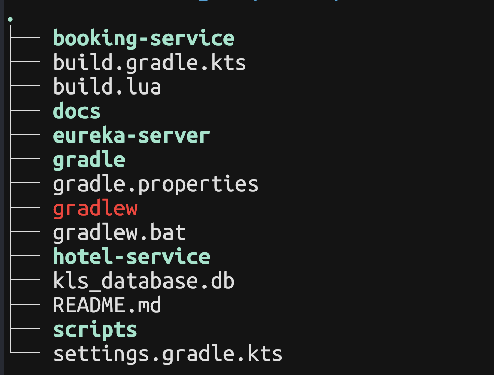
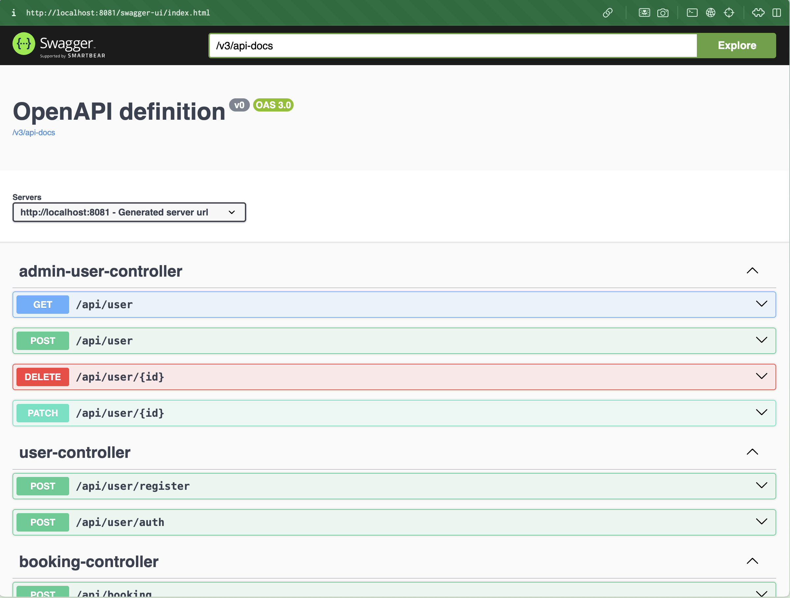
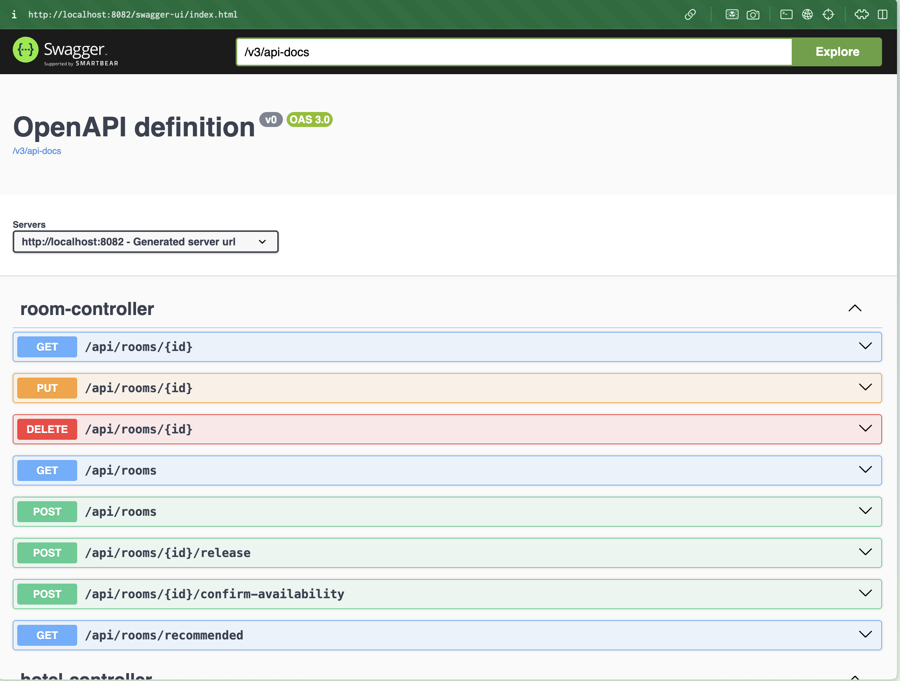

# Hotel Booker

## Prerequisites

- Java 17+
- Sprint 3.6
- Gradle 8.10.2
- JPA
- H2
- Swagger
- lua 5.1 (для тестов)

## Project structure



Модули:
- **:eureka-server**. Отвечает за работу с микросервисами. При запуске dashboard может быть найдет по [ссылке](http://localhost:8761/)
- **booking-service**. Отвечает за вход/регистрацию пользователей и бронирование номеров.
- **hotel-service**. Отвечает за работу с отелями и номерами

## How to run

Чтобы запустить приложение достаточно иметь необходимую версю java. Далее в разных окнах необходимо запустить 3 команды:

```bash
./gradlew :eureka-server:bootrun
./gradlew :booking-service:bootrun
./gradlew :hotel-service:bootrun
```

Так же из коммандной строки можно указать секретный ключ для авторизации:

```bash
export SECURITY_JWT_SECRET="тут можно ввести значение"
```

## Documentation

Документация по api может быть найдена по ссылкам при поднятии сервисов (*внимание ссылки ведут на localhost*):
- [**booking-service**](http://localhost:8081/swagger-ui/index.html)



- [**hotel-service**](http://localhost:8082/swagger-ui/index.html)



## Тестирование

Все интеграционный тесты находятся в папке [scripts](./scripts). В ней тесты написаны на языке Lua (по причине лучшей читаемости по сравнению с bash). Все тесты вместе собраны в файле [integration](./scripts/integration-tests.lua). Там можно увидеть в какой последовательности запускаются тест кейсы:

1. первыми идут тесты юзеров [users](./scripts/ts/users.lua)
2. делее проверки отелей/комнат/броней [hotels](./scripts/ts/hotels.lua) 

Чтобы запустить тесты достаточно написать:

```bash
cd ./scripts/
lua integration-tests.lua
```

> Все тесты запускаются с помощью `curl`. Если хочется видеть, какие именно запросы делаются, то в файле integration-tests.lua на самой верхней строке можно указать `LOGGING_REQUESTS = true`
